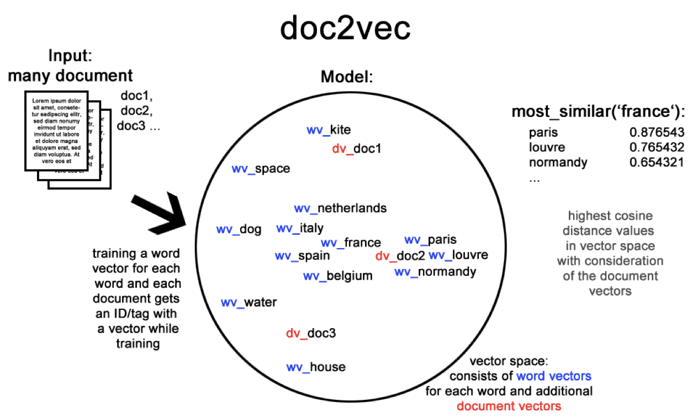

# Sentiment Analysis of Tweets Relating to Republican Party Presidential Debate Using doc2vec



## By: Joshua Acosta and Yangyang Chen

## Abstract

This study tries to implement a sentiment analysis on a group of Twitter posts concerning the first Republican Party Presidential debate in the year of 2016. The goal is to classify users’ attitudes into three categories by using Doc2vec, an extenstion of shallow neural network models called Word2vec. The methodology tries to create vectors from a group of words and measure their distance between each other. The experiment shows that the highest accuracy for this analysis reached 62% by using the Synthetic Minority Oversampling Technique (SMOTE SVM) as the sampling method and distributed memory (DM) as the training method. There are still challenges remained for future studies in terms of increasing the accuracy rate.

## Prerequisites

* Jupyter Notebook == 4.2.1
* Scikit-Learn == 0.19.0
* Gensim == 2.3.0
* Pandas == 0.19.2
* Matplotlib == 2.0.0
* Seaborn == 0.8.0
* Imbalanced-learn == 0.3.0

## How To Use

To clone and run this notebook, you'll need the prerequisties installed on your computer. From your command line:

```bash
# Clone this repository
$ git clone https://github.com/JoshuaAcosta/CS655-Sentiment-Analysis-Project.git

# Go into the repository
$ cd CS655-Sentiment-Analysis-Project

# Run the notebook
$ jupyter notebook
```


